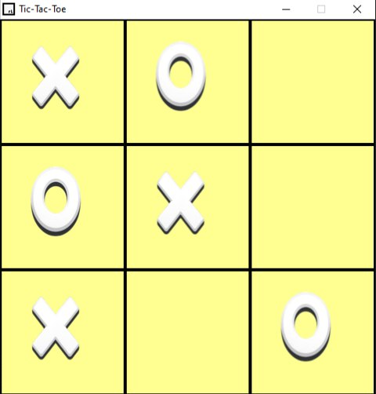
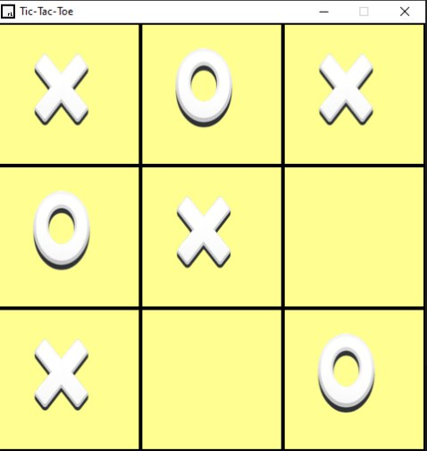

# Tic-Tac-Toe Game 🎮

A simple Tic-Tac-Toe game built with **C++** using the **raylib** library.

The game is designed to be easy and fun, with smooth gameplay and sound effects for different outcomes.

## Features
- Simple gameplay (easy to win)
- Sound effects for:
  - Win
  - Lose
  - Tie
- Infinite play:
  - The game automatically resets after each round
- Clean and minimal design

## Screenshots

## Built With
- **C++**
- **raylib**

## Notes
- You can play the game an unlimited number of times.
- All game states reset automatically after each match.

Enjoy playing! 🎉
